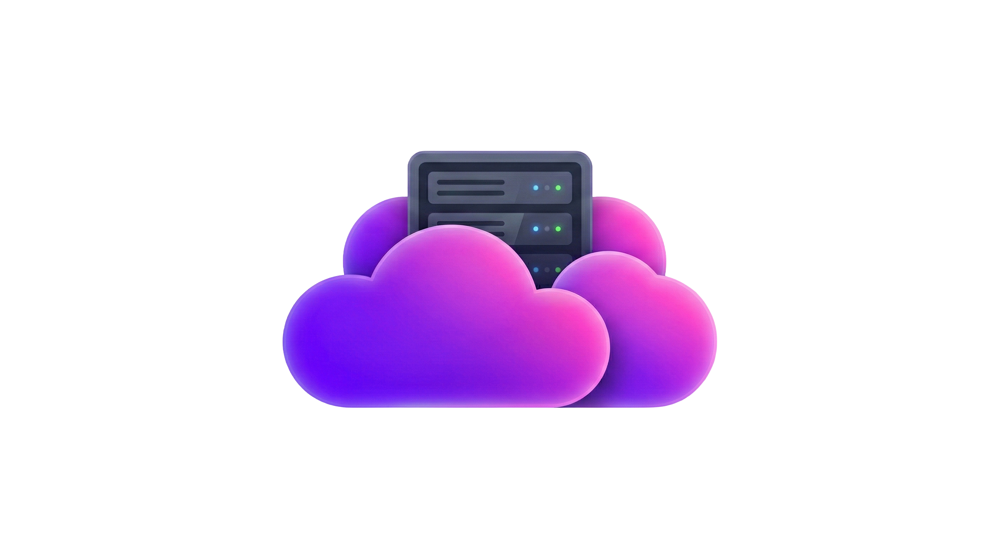
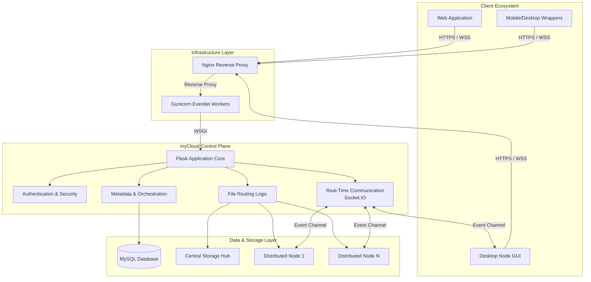

  
  <h1>myCloud</h1>
  
<em>A distributed, high-performance personal cloud platform built for the mySphere ecosystem.</em>

  

    <a href="https://cloud.mysphere.co.in"><strong>cloud.mysphere.co.in</strong></a> |
    <a href="https://mysphere.co.in"><strong>mysphere.co.in</strong></a>
  

---

## Executive Summary

**myCloud** is an advanced, distributed personal cloud platform engineered to provide seamless, secure, and scalable file management. Acting as a core component of the broader **mySphere** ecosystem, myCloud solves the limitations of traditional, centralized storage by introducing a node-based architecture where users can link private storage nodes to a unified control plane.

Designed with a focus on real-time synchronization, enterprise-grade security, and a beautiful, progressive user experience, myCloud empowers users with complete ownership over their data while maintaining the convenience of modern cloud services.

---

## Project Highlights

- **Distributed Storage Architecture:** Dynamic routing between a central control plane and user-hosted storage nodes.
- **Cross-Platform Ecosystem:** Support for Web, Desktop (CustomTkinter/Python CLI), and upcoming Mobile/Desktop Wrappers (Electron/Capacitor).
- **Real-Time Synchronization:** Event-driven architecture powered by Socket.IO for live file transfer statuses and node coordination.
- **Secure Authentication:** OAuth integration (Google/GitHub), 2FA capabilities, and rigorous session management.
- **Cloud Infrastructure:** Hosted on Oracle Cloud Infrastructure (OCI) with a robust Nginx/Gunicorn/Systemd reverse-proxy setup.
- **Production Deployment:** Automated deployment pipelines with custom synchronization scripts and zero-downtime architecture.
- **Observability and Monitoring:** Dedicated internal dashboards for system metrics, application activity, and product analytics.
- **Scalability Features:** Asynchronous background tasks, chunked data transfers, and modular backend routing.

---

## Overview

### What myCloud Does
myCloud provides unified access for file uploads, hierarchical organization, rich media previews, secure sharing, and stash workflows. It acts as the brain that coordinates data across various storage environments.

### Why It Was Built
As data privacy becomes increasingly critical, myCloud was built to bridge the gap between self-hosted NAS solutions and commercial cloud providers. It offers the privacy of local storage with the accessibility of a public cloud.

### Target Users
Power users, privacy advocates, and teams requiring a customizable, secure file collaboration environment without vendor lock-in.

### Core Philosophy
- **Secure-by-design:** Security isn't an afterthought; it's built into every route, token, and session.
- **Progressive Enhancement:** Offline fallbacks via Service Workers and responsive design for any device.
- **Data Sovereignty:** The user decides where the data lives.

### Key Differentiators
Unlike traditional platforms, myCloud features a **"Smart Relay"** distributed node system, a unique **Stash** workflow for temporary file lifecycle management, and a deeply integrated real-time monitoring suite.

---

## My Contributions

As the **Founder, System Architect, Backend Engineer, Infrastructure Engineer, and Product Developer**, I successfully led the end-to-end lifecycle of myCloud:

- **Architecture Design:** Designed the overarching distributed architecture separating the control plane from storage nodes.
- **Backend Development:** Built the robust Flask-based API, implementing complex routing, data chunking, and metadata management using MySQL.
- **Security Implementation:** Engineered custom CSRF middleware, Authlib OAuth flows, password hashing, and secure session state handling.
- **Infrastructure Deployment:** Provisioned and configured Oracle Cloud VPS instances, Nginx reverse proxy routing, and Gunicorn eventlet workers.
- **Cross-Platform Ecosystem Development:** Developed the responsive Web UI and parallel Desktop Node GUI clients using CustomTkinter.
- **Observability Systems:** Created custom monitoring daemons integrating `systemctl` / `journalctl` to visualize CPU/RAM/Network loads natively in the app.
- **Deployment Automation:** Wrote cross-platform PowerShell/Bash scripts (`deploy_changed_files.ps1`) for incremental deployments and automated service restarts.

---

## System Architecture

The architecture relies on a central **Control Plane** that manages identity, metadata, and security, while connected **Storage Nodes** handle the heavy lifting of file I/O operations.

### Architecture Highlights:
- **Control Plane:** A centralized Flask application managing user state, share link resolution, and metadata databases.
- **Storage Nodes:** Remote machines running the Python CLI or GUI Node client, connecting via WebSocket to register as storage destinations.
- **File Routing & Metadata:** A MySQL database maps every file to its physical storage node (`node_id`), allowing the control plane to route download/upload requests seamlessly.
- **Real-Time Communication:** Flask-SocketIO coordinates transfer statuses and broadcasts node connection states instantly to the web UI.

---

## Core Features

### Distributed Personal Cloud Infrastructure
A highly scalable storage engine where users can connect private hardware to expand their cloud capacity seamlessly.

### Secure File Management
Hierarchical folder management, batch operations (move/delete/download), and intelligent file previews for media and code. Includes a unique **Stash** feature for temporarily hiding files with scheduled cleanup lifecycles.

### File Sharing & Collaboration
- **Direct Invites:** Share files/folders securely with specific platform users.
- **Public Token Links:** Generate secure, expiring links for external access.
- **Batch Sharing:** Group multiple disparate files and folders into a single collaborative share link.

### Authentication & Security
Multi-layered security including local registration, email verification, 2FA challenges, and OAuth integrations (Google/GitHub).

### Real-Time Notifications
Instant push notifications within the app for shared file events, storage node status changes, and background task completions.

### Smart Search
Live, progressive search capabilities across all files and folders with context-aware results.

### Cross-Platform Access
A beautiful, responsive Progressive Web App (PWA) with offline capabilities, alongside native desktop utility clients.

### Monitoring & Observability
An integrated admin dashboard visualizing real-time CPU/RAM usage, Nginx/Gunicorn service health, and user product analytics.

### Deployment Automation
Incremental file synchronization scripts for continuous delivery without downtime.

---

## Technology Stack

| Category | Technologies |
| --- | --- |
| **Backend** | Python, Flask, Werkzeug |
| **Real-Time Communication** | Flask-SocketIO, python-socketio, Eventlet |
| **Databases** | MySQL, mysql-connector-python |
| **Infrastructure & Ops** | Oracle Cloud Infrastructure (OCI), Linux, systemd |
| **Deployment** | Nginx, Gunicorn, PowerShell/Bash Automation |
| **Security** | Authlib, itsdangerous, CSRF Middleware |
| **Frontend/Web** | HTML5, CSS3, Vanilla JS, Jinja2, Service Workers |
| **Desktop Technologies** | CustomTkinter, Tkinter, PyInstaller |
| **Mobile Technologies** | Electron, Capacitor (Roadmap) |

---

## Engineering Challenges

Building myCloud involved solving several complex distributed system problems:

1. **Distributed Storage Management:** Decoupling file metadata from the physical filesystem so files could live on remote user nodes without the central server buffering the entire file.
2. **Real-Time Synchronization:** Managing connection state drops and chunked file transfer resumptions over Socket.IO without memory bloat.
3. **Secure File Sharing:** Designing a unified database schema (`shares` table) to handle complex overlapping permissions (Read/Write/Admin) across individual files, folders, and batch groups.
4. **Authentication Systems:** Seamlessly blending session-based auth for the web app with token-based API authentication for remote storage nodes.
5. **Deployment Workflows:** Ensuring database migrations (e.g., `db_update_nodes.py`) and schema evolutions didn't cause downtime during active file transfers.
6. **Scalability Considerations:** Optimizing MySQL queries for recursive folder size calculations and using Eventlet for high-concurrency websocket connections.

---

## Screenshots & Visuals

*(Visual representations of the mySphere and myCloud ecosystem)*

  
  
  
<em>The myCloud and mySphere brand identities representing unified, secure ecosystems.</em>

> **Note:** Internal UI screenshots and dashboard views are kept private to protect proprietary layout designs and system architecture.

---

## Security Considerations

Security is a foundational pillar of myCloud. Key principles include:

- **Authentication & Authorization:** Strict RBAC (Role-Based Access Control) ensuring users can only access endpoints, files, and nodes they explicitly own or have been shared.
- **Session Security:** Utilization of `HttpOnly`, `Secure`, and `SameSite` session cookies with strict lifetime expirations.
- **CSRF Protection:** Custom middleware validates XSRF tokens on all state-changing mutations.
- **Data Protection:** Passwords securely hashed via Werkzeug security primitives. All database queries use parameterized inputs to prevent SQL Injection.
- **Access Control:** Storage nodes authenticate via secure API keys and handshake protocols before being trusted by the control plane.

*(Specific implementation details, encryption salts, and internal endpoint logic are strictly omitted from this public showcase.)*

---

## Product Ecosystem

myCloud is not just a standalone product; it is the data backbone of the **mySphere** ecosystem. Future integrations will allow other mySphere applications to utilize myCloud as a unified storage layer, creating a cohesive, Apple-like ecosystem experience where data flows securely across all user tools.

---

## Deployment & Infrastructure

The application runs in a highly optimized production environment:
- **Cloud Hosting:** Deployed on Oracle Cloud Infrastructure for high availability.
- **Reverse Proxy Architecture:** Nginx handles SSL termination, static file serving, and WebSocket upgrading, passing WSGI traffic to Gunicorn.
- **Service Management:** `systemd` manages application lifecycle, ensuring automatic restarts and comprehensive logging via `journalctl`.
- **Reliability:** Built-in Python daemons (`monitor.py`, `services.py`) actively ping local services to alert administrators of memory leaks or process crashes before they affect users.

---

## Lessons Learned

- **Distributed Architecture:** Learned the critical importance of eventual consistency and network partition tolerance when building the node relay system.
- **Security in Depth:** Mastered the nuances of secure cookie handling, CORS policies with WebSockets, and preventing directory traversal attacks during file uploads.
- **Product Engineering:** Discovered that progressive enhancement (e.g., adding PWA Service Workers) massively improves user retention by masking network latency.
- **Infrastructure:** Gained deep expertise in Linux system administration, process management, and optimizing WSGI servers for asynchronous I/O.

---

## Future Roadmap

Based on current functionality and active development (`future_plans.txt`), the roadmap includes:

- **Smart Relay System:** Enhancing storage nodes to queue and relay files when private servers go offline.
- **Advanced Search:** Implementing robust, full-text search across the backend and UI.
- **Deep Linking:** OAuth device flow and deep linking for seamless mobile-to-desktop authentication.
- **Ecosystem Wrappers:** Official release of the Electron and Capacitor mobile wrapper tracks.
- **CI/CD Integration:** Migrating from script-based deployment to fully automated GitHub Actions CI/CD pipelines.

---

## Repository Scope

> **IMPORTANT NOTICE:** 
> This repository is intended exclusively as a **project showcase and portfolio piece** for recruiters, researchers, and engineers. 
> 
> To protect proprietary business logic, infrastructure configuration, credentials, and core source code, **the actual application logic is not published here**. This README serves to demonstrate the architectural complexity, engineering decisions, and professional standards applied during the development of myCloud.

---

## Contact & Links

- **Live Platform:** [cloud.mysphere.co.in](https://cloud.mysphere.co.in)
- **Ecosystem Hub:** [mysphere.co.in](https://mysphere.co.in)
- **GitHub:** [github.com/rudy-07](https://github.com/rudy-07)
- **LinkedIn:** [linkedin.com/in/rudransh-shekhar](https://www.linkedin.com/in/rudransh-shekhar/)

  
Built with passion and engineering rigor. © 2026

